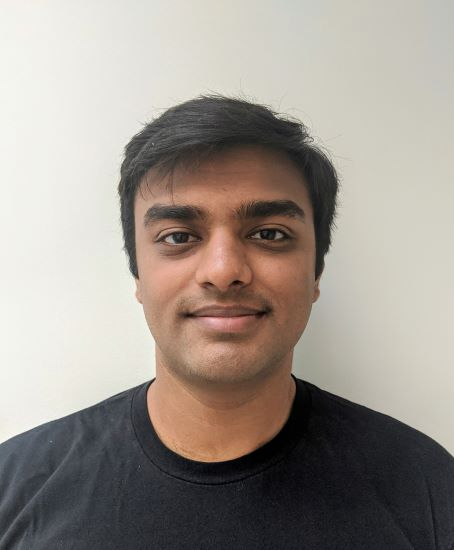

Hi all, my name is Aakash Mali and I'm a graduate from the University of Waterloo with a Bachelor of Applied Science in Mechatronics Engineering.

I love tinkering on different projects in my spare time that help me learn new technologies and designs. 

I'm passionate about robotics and love architecting embedded systems to control them.

This website showcases the different projects I've worked on and will be updated as I work on more projects!

## Content
Click on one of the links below to navigate to that given project. Click on the header to return to this page.

	- [Tronix BMS](tronix_bms.md)
	
	- [WatSize](watsize.md)
	
	- [Osprey Drone](osprey_drone.md)
	
	- [ThanOS RTOS](thanos.md)
	

## Quick Links
[LinkedIn](https://www.linkedin.com/in/aakash-mali/)
