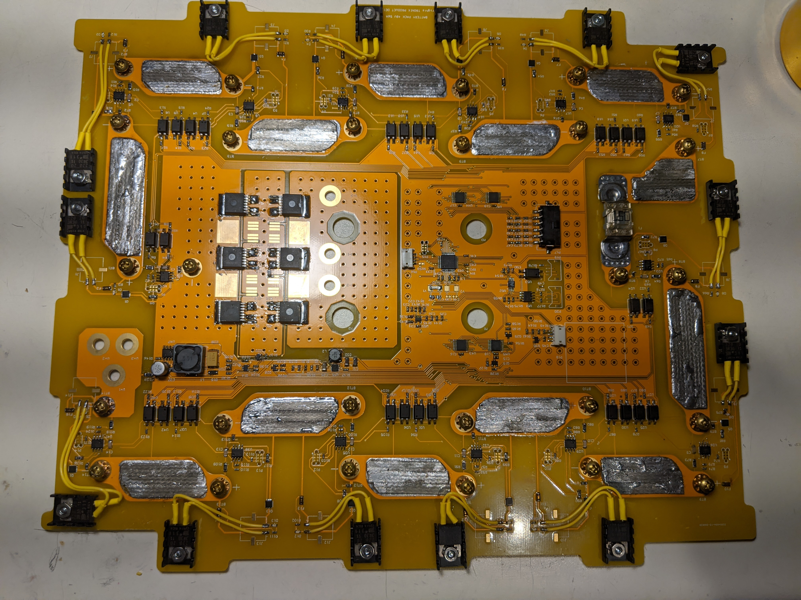

### Contents
  1. Tronix BMS
  2. Osprey Drone
  3. WatSize
  4. ThanOS

### Tronix BMS

#### Background
This project was inspired when needing a cost-efficient Battery Management Solution (BMS) for some other projects that are in the works.
I developed a BMS pack, cell, and user interface firmware for use with cell packs of varying sizes using Li-poly chemistry.
There were two primary boards to bring up: The Cell Pack board run on an PIC16F15313 and the full BMS board run on an STM32L4.

#### Features and Completed Work
The cell pack aims to:
  - Minimize current draw by entering a deep sleep mode when not active
  -	Report cell temperature, board temperature, and cell voltage 
  -	Bypass cell when commanded by battery management system

The BMS aims to:
  -	Minimize current draw by entering a deep sleep mode when turned off
  -	Communicate with up to 16 cell pack boards (above) via UART routed through two 8:1 muxes to reduce cost
  -	Provide an easy-to-use LCD GUI for configuration and diagnostics
  -	Prompt and save user configuration such as number of cells, min/max cell voltage, max charge current, max discharge current into non-volatile memory
  -	Implement a cell balancing algorithm to charge cells
  -	Disable charge/discharge FET when battery trips max charge/discharge limits 
  -	Track and display battery state-of-charge

Some additional features include enabling motor-mode, which prevents the system from shutting down due to temporary spikes in the current. 

#### Demos
This following video highlights the GUI connected to one variant of the full BMS system (8 packs connected). This battery pack replaced the traditional lead-acid battery that came with the Homelite Lawn Mower with a high-power Li-poly chemistry, making it lighter and lasting longer than the normal pack.

This following video highlights the GUI connected to another variant of the full BMS system (14 packs connected). This battery pack is a high-power version (3.3kWh) using the same firmware (with different constants).

The following are some pictures of the setup.

#### Future Work
  - Headless interface: Populate and create isolated I2C interface for future devices to configure/read data from the BMS without GUI
  - Advanced State-of-Charge and State-of-Health: Currently SOC is using a simple linear scale from the minimum specified voltage to the maximum, user configured in the pack setup. It would be beneficial to upgrade that to a state observer model for more accurate battery health and charge data.
  
  
### Osprey Drone

#### Background
I realized that it would be a cool project to make my own VTOL drone with the ability to swivel it's wings during takeoff and landing. The benefits would be a small takeoff footprint, while taking advantage of the energy efficiency of a fixed-wing aircraft (versus a quadcopter).
The drone for starters will be remote controlled using a standard radio remote control, however, will hopefully act as a platform for future projects.

#### Features and Completed Work
Mechanical work:
  - Designed the drone from scratch in Solidworks using the Bell Boeing Osprey as a reference
  - 3D printed all parts of the drone and glued using interlocking joints and a lightweight resin
  - Created mounts for motors/servos compatible with various available fasteners
  - Started Covering the drone with covering film
Firmware/Electrical work:
  - Used an STM32F0 to convert the 6-channel input from the radio receiver Using a 6channel receiver to control mode specific surfaces/features (7+ channels) 
  - Prototyped a small board to mux the radio receiver outputs to the STM32F0, which in turn controlled all servos and motors connected
  
#### Demos
The following pictures are stages in the mechanical development of the drone

The following video is a demonstration of the wing/servo controls routed through the STM32F0 micro
#### Future Work
Mechanical:
  - Covering film needs to be completely applied without as many wrinkles (may need to slightly re-design fuselage/wings)
  - Create internal mounts for computers/receivers
Software: 
  - Add a Raspberry Pi camera/compute to enable the drone to do more advanced tasks (such as stream heads-up video back to base controller)

### WatSize

#### Background
WatSize is a result of my Fourth-Year-Design-Project with exact details found [here](https://watsize.github.io/). This entry is to mainly highlight the hardware aspect which was my contribution to the team.

The WatSize hardware consists of:
  - Scanner Kit
    - 2D-Lidar
    - Camera
    - Motor Controller
    - Ethernet Adapter
    - STM32F1
  - Turntable
    - Large wooden base
    - Lazy-susan with keyed base for motor
    - Motor
    - Harness connected to Scanner Kit
 
#### Features and Completed Work
Scanner Kit:
  - Interfaced with UART based 2D-lidar
  - Interfaced with SPI based camera system to capture photos on demand
  - Implemented PID control to rotate base at constant velocity to provide a uniform point cloud for easier analysis
  - Interfaced with several layers of the IP stack to allow the device to communicate with an AWS server using MQTT for continuous data offload
Turntable:
  - Created a large wooden base using 2x8's to house the motor and take the weight of users.
  - Used Lazy-Suzy as turntable base for users to stand on.
  
#### Demos
The pictures below showcase the Scanner kit that I prototyped.

The video below showcases the full-stack. 
The phone sends a command to the AWS server, which in turns sends a command to the scanner kit to start the scanning process. Next the scanner kit takes a picture and starts rotating the turntable while streaming the point cloud data back the AWS server. Upon completion it sends a 'scan complete' message so the server may start parsing the data. Next the server transforms the point cloud to a meaningful 'avatar' of the person and takes measurements. These measurements get sent back down to the user's phone.

#### Future Work
  - Powerful MCU: Replace the STM32F1 with a more powerful MCU to enable continuous streaming of camera data over ethernet. The current method only supports taking a picture and immediately sending it due to lack of on-board storage
  - FreeRTOS: Add an ethernet enabled RTOS for better timing guarantees

### ThanOS
This proect involved the creation of a custom Send-Receive-Reply based Real Time Operating System designed for the STM32F4 to interface with a UART console and train set.
The system was named ThanOS (Thanos from the Avenger movies) since during development bugs were found where GCC inserted assembly instruction muddling callee saved registers that were caused by adding inline assembly. This project is one of my favourites as I got a chance to explore why FreeRTOS (and other RTOS's for that matter) made API and implementation decisions they did.

#### Features and Completed work
-	Developed UART and timing servers for the RTOS to enable communication with a train set and terminal console
-	Validated functionality of RTOS by writing simple programs that interface with all servers
-	Troubleshot bugs in assembly when GCC inadvertently modified user-mode registers

#### Future work
 - Redesign: This was created for a 4th year course and could use touch up from knowledge I've gained since: the kernel-entry and exit could be made more efficient
 - FreeRTOS equivalent? : It would be a challenging and fun project to make a feature complete RTOS for the sake of better understanding
