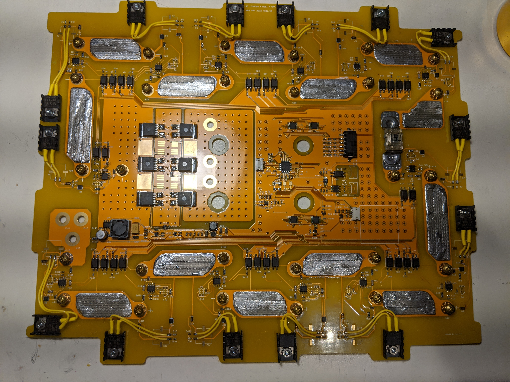

## Tronix BMS

#### Background
This project was inspired when needing a cost-efficient Battery Management Solution (BMS) for some other projects that are in the works.
I developed a BMS pack, cell, and user interface firmware for use with cell packs of varying sizes using Li-poly chemistry.
There were two primary boards to bring up: The Cell Pack board run on an PIC16F15313 and the full BMS board run on an STM32L4.

#### Features and Completed Work
The cell pack aims to:
  - Minimize current draw by entering a deep sleep mode when not active
  -	Report cell temperature, board temperature, and cell voltage 
  -	Bypass cell when commanded by battery management system

The BMS aims to:
  -	Minimize current draw by entering a deep sleep mode when turned off
  -	Communicate with up to 16 cell pack boards (above) via UART routed through two 8:1 muxes to reduce cost
  -	Provide an easy-to-use LCD GUI for configuration and diagnostics
  -	Prompt and save user configuration such as number of cells, min/max cell voltage, max charge current, max discharge current into non-volatile memory
  -	Implement a cell balancing algorithm to charge cells
  -	Disable charge/discharge FET when battery trips max charge/discharge limits 
  -	Track and display battery state-of-charge

Some additional features include enabling motor-mode, which prevents the system from shutting down due to temporary spikes in the current. 

#### Demos
This following video highlights the GUI connected to one variant of the full BMS system (8 packs connected). This battery pack replaced the traditional lead-acid battery that came with the Homelite Lawn Mower with a high-power Li-poly chemistry, making it lighter and lasting longer than the normal pack.

[Link to the video (google photos)](https://photos.app.goo.gl/hAgS2W5BWyhUqBS59)

This following video highlights the GUI connected to another variant of the full BMS system (14 packs connected). This battery pack is a high-power version (3.3kWh) using the same firmware (with different constants).

[Link to the video (google photos)](https://photos.app.goo.gl/8eBsoDNsRfbQidZK8)

The following are some pictures of the setup.

#### Future Work
  - Headless interface: Populate and create isolated I2C interface for future devices to configure/read data from the BMS without GUI
  - Advanced State-of-Charge and State-of-Health: Currently SOC is using a simple linear scale from the minimum specified voltage to the maximum, user configured in the pack setup. It would be beneficial to upgrade that to a state observer model for more accurate battery health and charge data.
  
