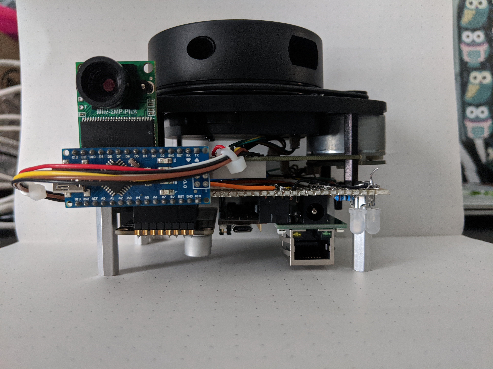

### Background
WatSize is a result of my Fourth-Year-Design-Project with exact details found [here](https://watsize.github.io/). This entry is to mainly highlight the hardware aspect which was my contribution to the team.

The WatSize hardware consists of:
  - Scanner Kit
    - 2D-Lidar
    - Camera
    - Motor Controller
    - Ethernet Adapter
    - STM32F1
  - Turntable
    - Large wooden base
    - Lazy-susan with keyed base for motor
    - Motor
    - Harness connected to Scanner Kit
 
### Features and Completed Work
Scanner Kit:
  - Interfaced with UART based 2D-lidar
  - Interfaced with SPI based camera system to capture photos on demand
  - Implemented PID control to rotate base at constant velocity to provide a uniform point cloud for easier analysis
  - Interfaced with several layers of the IP stack to allow the device to communicate with an AWS server using MQTT for continuous data offload
  
Turntable:
  - Created a large wooden base using 2x8's to house the motor and take the weight of users.
  - Used Lazy-Suzy as turntable base for users to stand on.
  
### Demos
The pictures below showcase the Scanner kit that I prototyped.

The video below showcases the full-stack. 

<iframe width="686" height="386" src="https://www.youtube.com/embed/zwd_XmAY304" frameborder="0" allow="accelerometer; autoplay; clipboard-write; encrypted-media; gyroscope; picture-in-picture" allowfullscreen></iframe>

The phone sends a command to the AWS server, which in turns sends a command to the scanner kit to start the scanning process. Next the scanner kit takes a picture and starts rotating the turntable while streaming the point cloud data back the AWS server. Upon completion it sends a 'scan complete' message so the server may start parsing the data. Next the server transforms the point cloud to a meaningful 'avatar' of the person and takes measurements. These measurements get sent back down to the user's phone.

### Future Work
  - Powerful MCU: Replace the STM32F1 with a more powerful MCU to enable continuous streaming of camera data over Ethernet. The current method only supports taking a picture and immediately sending it due to lack of on-board storage
  - FreeRTOS: Add an Ethernet enabled RTOS for better timing guarantees